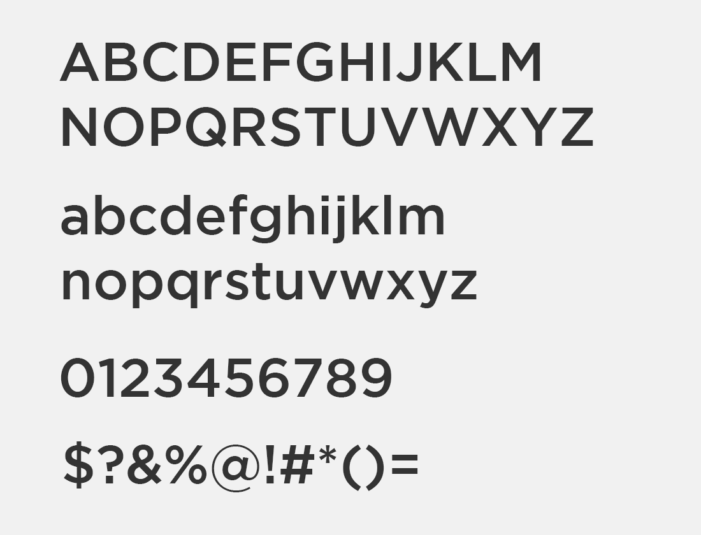

# Keplr Browser Extension

## Before we Start

Please note the following important announcements:


**Keplr extension is only officially supported by the Google Chrome browser.**

There is a Brave extension available but may lack some features of the Chrome version.   
There is no mobile version available at the time of writing but there is one in development.   
There is no official Keplr extension for Firefox. Be aware of scammers.



**Please be aware that you must never provide your "mnemonic" \(aka "private key" or "seed phrase"\) to anyone, EVER. No individual from the Juno team will EVER request you provide provide this and it is not required for any technical support purpose whatsoever.**


This tutorial assumes you are using the Chrome browser.

## **Install Keplr Browser Extension**

1. Follow this [link ](https://chrome.google.com/webstore/detail/keplr/dmkamcknogkgcdfhhbddcghachkejeap?hl=en)to the official Keplr browser extension on the chrome web store and click on the **Add to Chrome** button.

2. A dialogue window will appear requesting permission to add "Keplr". Click the **Add extension** button.

3. By default, the extension icon will be nested under the extensions icon on the toolbar in the top right of the browser. Click the extensions icon and then click the pin icon to make Keplr visible in the toolbar.

4. The keplr extension can now be interacted with by clicking on the Keplr icon.

## Accounts

You now have 3 options to add and import accounts to the Keplr extension. After clicking on the Keplr extension icon for the first time you will be presented with a new browser tab where you can either:

* [Create a new account](keplr-browser-extension.md#create-new-account),
* [Import an existing account](keplr-browser-extension.md#import-an-existing-account), or
* [Import ledger](keplr-browser-extension.md#import-ledger).

### Create new account

1. After clicking on the **Create new account** button you will be presented with a a "mnemonic seed" as well as fields for your "Account name", "New Password" and "Confirm password".


**Before continuing:** Write down your "Mnemonic Seed" on a piece of paper. Store these words in a secure place and **NEVER** provide them to anyone. This phrase is the only way to recover your account if you lose access to the Keplr extension and it is the **ONLY** way to migrate you account to another wallet. Anyone who has this Mnemonic Seed can access and withdraw your crypto tokens.

**DO NOT:** Take screenshots or store these words digitally.


2. Enter your chosen account name and password for the account, and then click the **Next** button.

3. You will be prompted to enter your mnemonic seed by clicking the words in the correct order from the previous screen. Select the words in order and click the **Register** button when it is unlocked by successfully selecting the words in order.

4. The following screen will let you know "You're all set!". Click the **Done** button to finish.

### Import an existing account

Work in progress

### Import ledger

Work in progress

